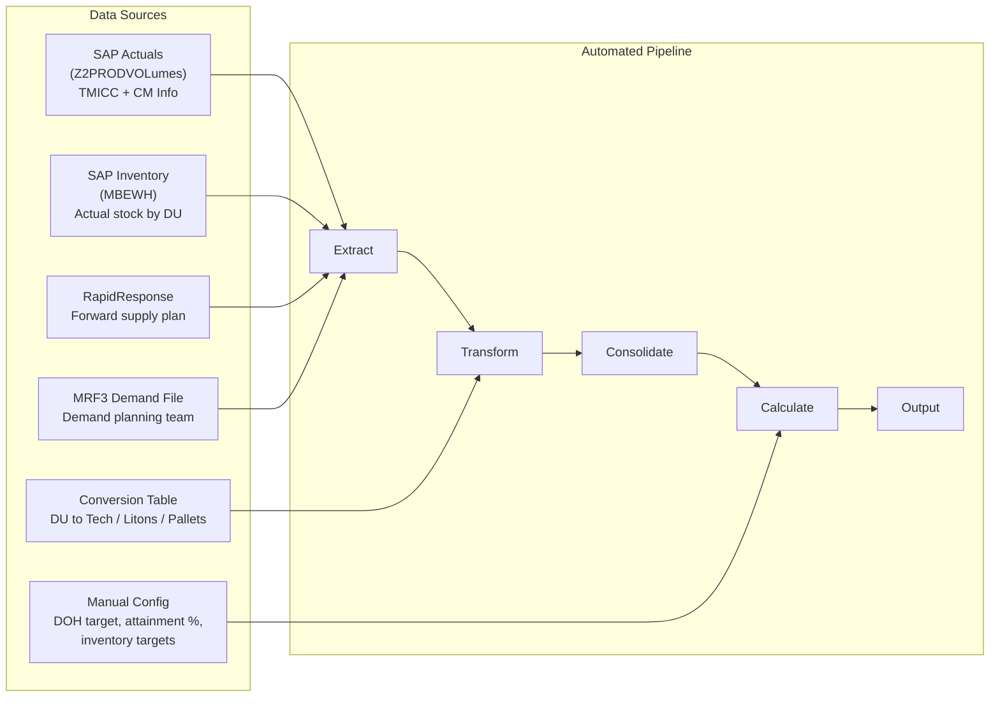
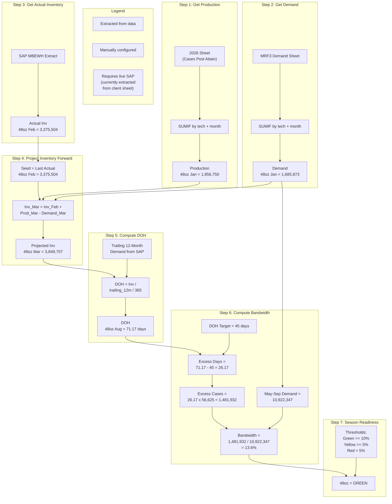

# S&OP Calculation Pipeline — Flowchart & Reference

This document explains how the automated S&OP pipeline works, step by step.
All examples use **48oz**, one of the largest technology formats by volume.

---

## 1. High-Level Pipeline Flow



**What each stage does:**

- **Extract** — Reads all source Excel files into clean DataFrames
- **Transform** — Joins conversion tables, applies attainment %, converts cases to litons and pallets
- **Consolidate** — Merges supply + demand + inventory into one master view per technology per month
- **Calculate** — Projects inventory forward, computes DOH, bandwidth, season readiness
- **Output** — Generates Excel workbook, CSVs, and season readiness report

---

## 2. Calculation Flow for One Technology

This diagram shows how each metric is calculated for a single tech (48oz).
Pay attention to the legend — it tells you where each piece of data comes from.



---

## 3. Formula Reference (with 48oz examples)

### Inventory Projection

For months with SAP actuals (Jan, Feb), the actual MBEWH value is used directly.
For projected months (Mar onward), the rolling formula kicks in:

```
Inv[t] = Inv[t-1] + Production[t] - Demand[t]
```

**48oz example — March:**

```
Inv[Mar] = Inv[Feb]   + Production[Mar] - Demand[Mar]
         = 3,375,504  + 2,894,790       - 2,420,537
         = 3,849,757
```

The seed (Dec 2025 actual = 2,642,489) is stored but NOT used directly because
Jan and Feb have their own MBEWH actuals. The projection starts from the last actual month.

### DOH (Days on Hand)

```
DOH = Inventory / (Trailing_12_Month_Demand / 365)
```

**48oz example — August:**

```
DOH = 4,030,064 / (20,668,183 / 365)
    = 4,030,064 / 56,625
    = 71.17 days
```

**Important:** The trailing 12-month demand includes 2025 historical actuals from SAP.
This data is NOT in the MRF3 Demand file (which only has 2026). Currently, DOH values
are extracted directly from the client's "Inv By Tech Post Attain" sheet. Once connected
to live SAP, the pipeline can compute DOH natively.

### Bandwidth (Season Readiness)

```
Excess_Days  = Peak_DOH - DOH_Target
Excess_Cases = Excess_Days x (Peak_Inv / Peak_DOH)
Bandwidth    = Excess_Cases / May_Sep_Demand
```

**48oz example:**

```
Excess Days  = 71.17 - 45 = 26.17 days
Daily Rate   = 4,030,064 / 71.17 = 56,625 cases/day
Excess Cases = 26.17 x 56,625 = 1,481,932 cases
May-Sep Dem  = 10,922,347 cases
Bandwidth    = 1,481,932 / 10,922,347 = 13.6%
```

**Interpretation:** If actual demand from May-Sep is 13.6% higher than planned,
48oz would still land at exactly 45 DOH. That gives comfortable buffer = Green.

### Season Readiness Thresholds

```
Green  : Bandwidth >= 10%   (comfortable buffer)
Yellow : Bandwidth >= 5%    (watch closely)
Red    : Bandwidth < 5%     (at risk — action needed)
```

Note: thresholds are configurable per technology in `config/manual_adjustments.yaml`.

---

## 4. Data Source Legend

### Extracted from Source Files

| Data | Source System | File |
|------|-------------|------|
| Actual Supply (TMICC) | SAP table Z2PRODVOLumes, txn Z0SWT0055TRN | `PTG 2026 Actuals TMICC and CM...xlsx` |
| Actual Supply (CM/Imports) | SAP (same extraction) | Same file, "CM Info" + "Sheet5" tabs |
| Forward Supply (RR) | RapidResponse u_production_volumes | `Converting 3pm-Import and all RR...xlsx` |
| Master Supply (combined) | John's master dataset (all of the above merged) | `PTG for 2026_MRF3...xlsx`, sheet "2026" |
| Demand Forecast | Demand planning team (Anaplan/RR) | `PTG for 2026_MRF3...xlsx`, sheet "MRF3 Demand" |
| Actual Inventory | SAP MBEWH | `Feb 2026 Inventory...xlsx` |
| DU-to-Tech Conversion | Manual Excel table | `Converting MRF File...xlsx`, sheet "Tech Pallet" |
| Attainment Factors | PTG master | `PTG for 2026_MRF3...xlsx`, sheet "Attain %" |
| Inv Seeds (Dec 2025 actual) | "Inv By Tech Post Attain" sheet | `PTG for 2026_MRF3...xlsx` |
| DOH Values (all 12 months) | "Inv By Tech Post Attain" sheet | `PTG for 2026_MRF3...xlsx` |

### Manually Configured (updated each planning cycle)

| Parameter | Current Value | Config File | Notes |
|-----------|--------------|-------------|-------|
| DOH Target | 45 days | `config/manual_adjustments.yaml` | End-of-season target |
| Inv Target Apr | 4,000,000 cases | Same file | Peak season checkpoint |
| Inv Target Aug | 3,000,000 cases | Same file | End of season checkpoint |
| Inv Target Dec | 2,900,000 cases | Same file | Year-end / cash target |
| Attainment % (48oz) | 94% | Same file | Applied to raw supply |
| Attainment % (default) | 96% | Same file | Fallback for unlisted techs |
| BW Threshold (default) | Green >= 10%, Yellow >= 5% | Same file | Per-tech overrides available |
| Manual Demand Add-ons | B&J Exports: 90K/mo, etc. | Same file | Dependent demand, SMOG, exports |
| Site Name Mapping | 1352 = Covington, etc. | `config/conversion_tables.yaml` | Plant code to name |
| Tech Normalization | TALENTI = Talenti, etc. | Same file | Canonical tech names |

### Unknown / Requires Live SAP Connection (future state)

| Data | Why It Matters | Current Workaround |
|------|---------------|-------------------|
| Trailing 12-month demand (incl. 2025) | Needed for DOH denominator | Extract DOH from client's sheet |
| Weekly inventory snapshots | John manually emails weekly inventory | Only monthly MBEWH extract available |
| Real-time supply plan updates | RR plans change between cycles | Static monthly extraction |
| Innovation items not in SAP | New products without master data | Manual entry in config YAML |
| Weighted average cost for MATDI | Needed for financial MATDI rollup | Separate process, not in scope |

---

## 5. Quick Reference: Current 48oz Numbers (MRF3 2026)

```
Technology:     48oz
DOH Target:     45 days
Attainment:     94%

Month     Production    Demand      Inventory     DOH
Jan        1,856,750   1,685,873    2,807,066    41.5
Feb        2,213,068   1,636,436    3,375,504    45.8
Mar        2,894,790   2,420,537    3,849,757    53.7
Apr        2,353,352   2,003,950    4,199,160    52.3  <-- Inv Target: 4.0M
May        2,119,702   2,294,148    4,024,714    50.6
Jun        2,281,861   2,519,920    3,786,655    51.5
Jul        2,318,930   2,248,431    3,857,154    60.0
Aug        2,334,003   2,161,093    4,030,064    71.2  <-- Inv Target: 3.0M
Sep        1,732,120   1,698,755    4,063,429    63.6
Oct        1,687,021   1,801,334    3,949,117    64.5
Nov        1,215,971   2,033,844    3,131,243    56.5
Dec        1,215,971   1,639,652    2,707,562    48.9  <-- Inv Target: 2.9M

Bandwidth:        13.6%
Season Readiness: GREEN
Over/Under Aug:   +26.2 days above 45-day target
```
